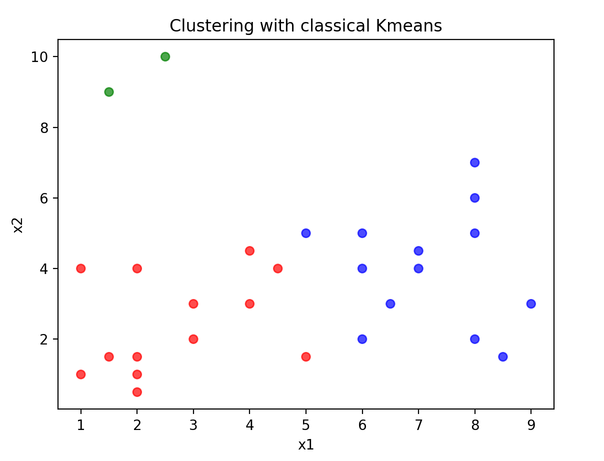
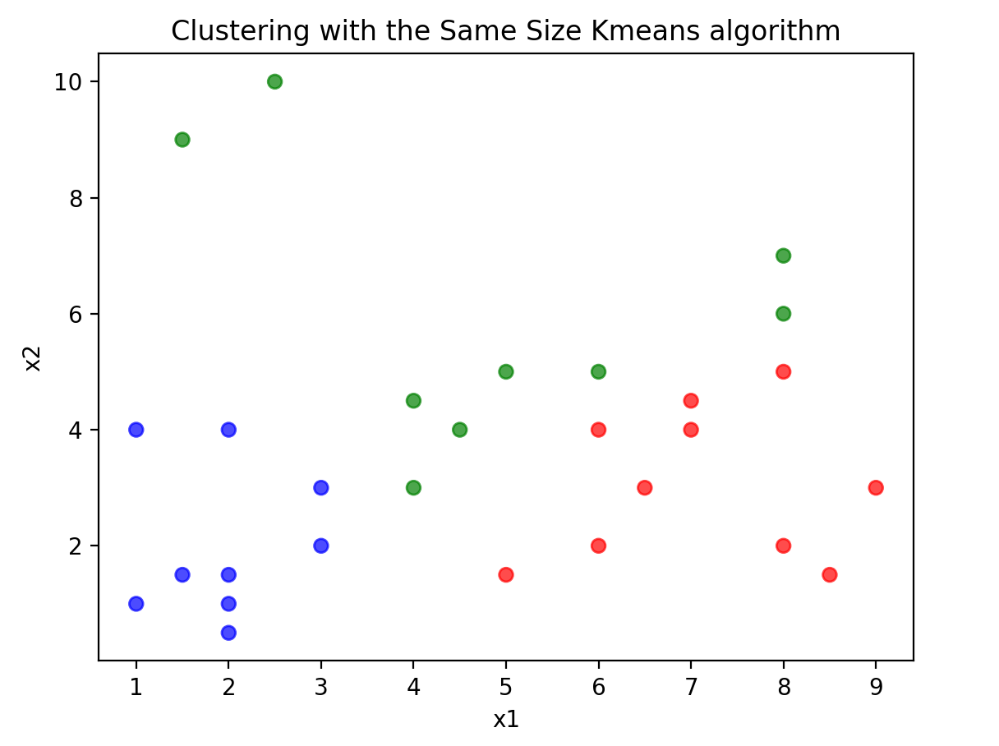

# Same Size Clustering

Simple package to create a same size clustering (inspired from a regular Kmeans with size constraints)

## A more detailed explanation

Most of the time, a K-means clustering will provide unequal clusters.

If the clustering is used for its own or at the end of a process it does a pretty good job to create consistent clusters.

However, if a such clustering is used as part of a sampling process before other operations, 
then size of cluster is also as important as the closeness & consistency of clusters.

## Illustration

Let's have a look on the result of a Kmeans algorithm:



By creating 3 clusters in this data, it creates a cluster with only 2 points (7% of points).
Far from an equal assignment of points (which would be about 9 points). 

The "Same Size Kmeans" algorithm can force this assignment to be more equal in term of size:


 
## The algorithm 

Explained by the [ELKI project](https://elki-project.github.io/tutorial/same-size_k_means).


Initialization:

1. Compute the desired cluster size, n/k.
2. Initialize means, preferably with k-means++
3. Order points by the distance to their nearest cluster minus distance to the farthest cluster (= biggest benefit of best over worst assignment)
4. Assign points to their preferred cluster until this cluster is full, then resort remaining objects, without taking the full cluster into account anymore

Iteration:

1. Compute current cluster means
2. For each object, compute the distances to the cluster means
3. Sort elements based on the delta of the current assignment and the best possible alternate assignment.
4. For each element by priority:

    1. For each other cluster, by element gain, unless already moved:
    
        1. If there is an element wanting to leave the other cluster and this swap yields and improvement, swap the two elements
    
        2. If the element can be moved without violating size constraints, move it
    
    2. If the element was not changed, add to outgoing transfer list.
5. If no more transfers were done (or max iteration threshold was reached), terminate


## How to run it

### Import package


The simple way will be to install the package from github with pip : `pip install git+https://github.com/Eliot-M/sskmeans.git`

Or manually download and run both sskmeans.py and support-functions.py.


### How to use it ?

#### How to quickly create a model

The way to create this clustering is the same as the way sklearn creates model.

`my_model = SameSizeKmeans()`

Then data can be fitted in the instance `my_model`. 
Data must be a numpy ndarray or a pandas dataframe.

`my_model.fit(my_data)`

Clusters can be added as the last column by using the method `transform` as follow:

`my_model.transform(my_data)`


#### Available parameters

`n_clusters`, int, default=4: 

The number of clusters to form as well as the number of centroids to generate.

`max_iter`, int, default=100: 

Maximum number of iterations of the k-means algorithm for a single run.


`flexibility`, int or float, default=0:

Flexibility of clusters sizes in units (if greater than 1) or in percentage(if smaller than 1).

`random_state`, int, RandomState instance, default=None:

Determines random number generation for centroid initialization. Use an int to make the randomness deterministic.

`distance`, str, default='euclidean':

Metric to use to compute distance (to minimize) between centroids and points. Only 'euclidean' is implemented for now.


#### Available attributes

All parameters are available as attributes of the instance with their own name.
Only one exception is `n_clusters` which is available under the attribute name `k_clusters`.

`_n_samples`, int:

Number of rows found and used as single item in the dataset.

`_n_features`, int:

Number of columns found and used as axis in the dataset.

`_k_min`, int:

Minimum (theoritical) size of a cluster, including the flexibility.

`_k_max`, int:

Maximum (theoritical) size of a cluster, including the flexibility.

`_k_centers`, dict:

Dictionary of k centers. Keys are clusters id and values are coordinates along axis.

`_n_assign`, dict:

Dictionary of cluster assignation. Keys are items and values are assigned clusters.


#### Example

```
# Get some data 
data = pd.DataFrame({'x1': [1., 1, 1, 1.5, 1.5, 2, 2, 2.5, 3, 4.5, 5, 5, 6, 6.5, 7, 8, 8, 3, 2, 4, 6, 8, 2, 4, 6, 7, 8, 8.5, 9],
                     'x2': [1., 4, 8., 1.5, 8, 1, 1.5, 10, 3, 4, 1.5, 5, 2, 3, 4, 6, 5, 2, 1, 3, 5, 7, 4, 4.5, 4, 4, 2, 1.5, 3]})

# Create an instance model object
model = SameSizeKmeans(n_clusters=3, flexibility_size=0, random_state=None, max_iter=50)

# Fit in on data
model.fit(data)

# Return data with clusters
data_out = model.transform(data)

```
